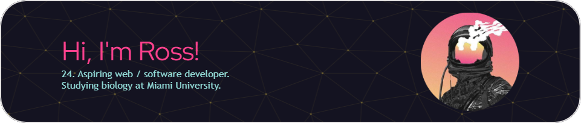

<div align="center">

---

```
Data Integration Intern @ Miami University (OH)
Software Developer (AI Trainer) @ DataAnnotation
```
---


---

</div>
<!--  -->
<!--  -->
<!-- [](https://github.com/endeared/github-readme-stats) -->
